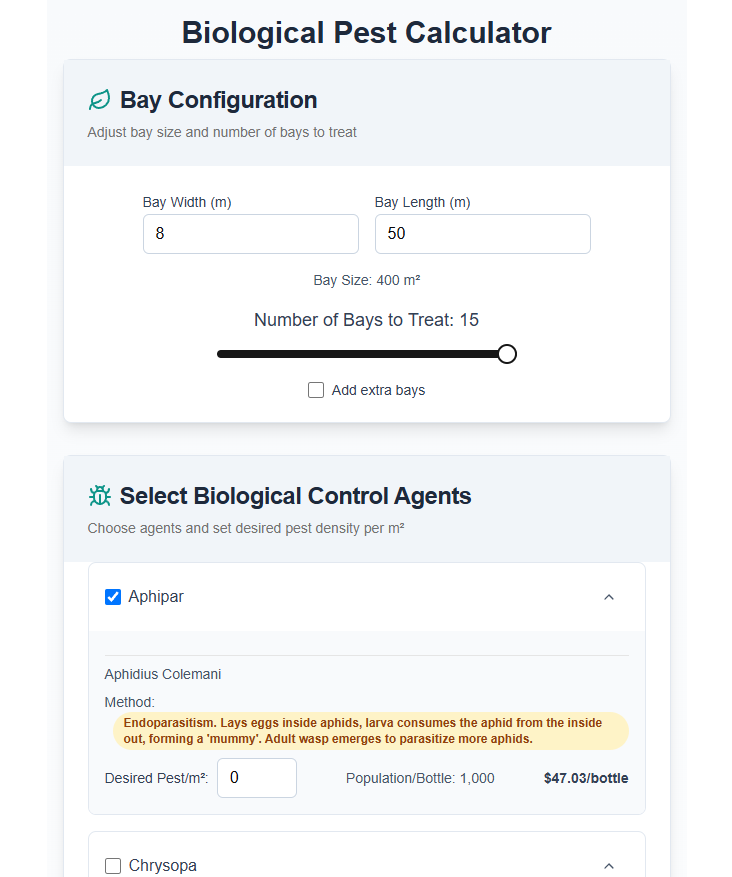

# IPM Calculator

## Description

 The IPM (Integrated Pest Management) Calculator is a web-based tool designed to help agricultural professionals and growers calculate the optimal use of biological control agents for pest management.

 This application allows users to select from a variety of beneficial insects and mites, specify the area to be treated, and calculate the required quantities and associated costs.

## Features

- 🌱 Interactive bay configuration
- 🐞 Comprehensive list of biological control agents and price controls for allowing users to modify bio prices to their local suppliers
- 📊 Real-time calculations of pest quantities, costs and exportable PDF reports
- 📱 Responsive design for desktop and mobile



## Quick Start

```bash
git clone https://github.com/0xKnowles/ipm-calculator.git
cd ipm-calculator
npm install
npm run dev
